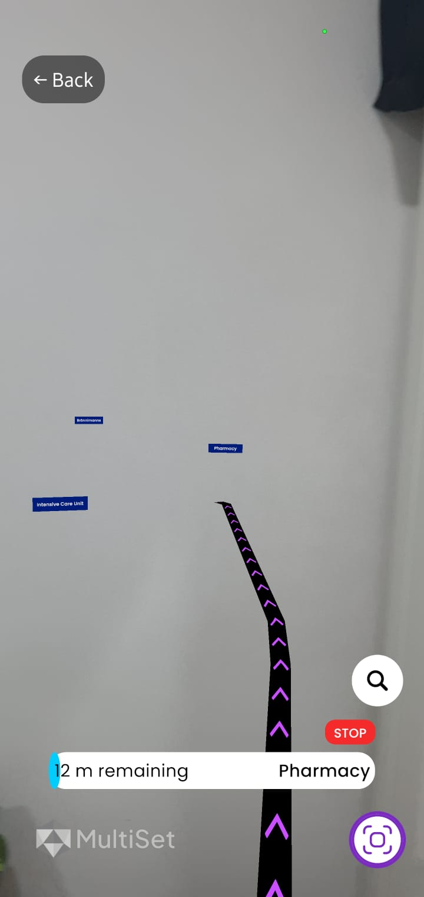

# ARoundNUS

<div align="center">
  
  
  
</div>

## Project Idea

ARoundNUS is an innovative augmented reality (AR) application designed to enhance the navigation and exploration experience at the National University of Singapore (NUS). The app aims to help students, staff, and visitors discover and interact with various locations and points of interest across the campus in an engaging and intuitive way.

## Features

- **AR Navigation**: Real-time directional guidance using augmented reality
- **Points of Interest**: Discover and learn about key locations on campus
- **Interactive Map**: 2D map view with searchable locations
- **Information Hub**: Detailed information about buildings, facilities, and services
- **User Authentication**: Sign in with email/password, Google, or Apple accounts
- **Social Interactivity and Sharability**: Ability to share routes and location info with other app users

## Technologies Used

### Frontend

- **React Native**: Cross-platform mobile development framework
  - _Justification_: Enables development for both iOS and Android with a single codebase
- **Expo**: Development framework and platform for React Native
  - _Justification_: Simplifies development process and provides essential tools and services

### Authentication

- **Firebase Authentication**: User authentication service
  - _Justification_: Secure and easy-to-implement authentication with multiple sign-in methods
- **Google Sign-In**: OAuth-based authentication for Google accounts
  - _Justification_: Provides a familiar and secure sign-in option for users

### AR Technology

- **Unity**:
  - _Justification_: Industry standard with a wide range of libraries that integrate seamlessly with Android's ARCore and iOS' ARKit SDKs and the ability to embed Unity projects within React Native applications
- **MultiSet SDK**
  - _Justification_: Granular control over mapping process while still being able to simply use any LiDAR-enabled smartphone, good localization speeds and accuracies, and the ability to stitch maps together thereby simplifying scalability of future extensions greatly

### Backend

- **Firebase**: Backend-as-a-Service platform
  - _Justification_: Provides authentication, database, and storage services in one platform
- **Firestore**: NoSQL cloud database
  - _Justification_: Flexible, scalable database for storing application data
 
## File structure

```
aroundnus/
│
├── assets/                  # Images for README.md
│
├── frontend/                # React Native (Expo) mobile app
│   │
│   ├── app/                 # App entry and routing (Expo Router)
│   │   ├── (tabs)/          # Tab navigation screens
│   │   ├── (modals)/        # Modal screens
│   │   ├── _layout.tsx      # Main layout
│   │   └── signin.tsx       # Sign-in screen
│   ├── components/          # Reusable UI components
│   │   ├── ui/              # UI primitives (buttons, icons, etc.)
│   │   └── navigation/      # Navigation-related components
│   ├── constants/           # App-wide constants (colors, etc.)
│   ├── hooks/               # Custom React hooks
│   ├── scripts/             # Utility scripts (e.g., reset-project.js)
│   ├── assets/              # App-specific assets (images, fonts)
│   └── ...                  # Other files
│
├── backend/                 # Node.js/Express backend API
│   │
│   ├── config/              # Configuration files (e.g., firebase.js)
│   ├── controllers/         # Route controllers (business logic)
│   ├── middleware/          # Express middleware (e.g., auth)
│   ├── routes/              # Express route definitions
│   ├── tests/               # Automated tests (Jest)
│   ├── coverage/            # Test coverage reports
│   ├── index.js             # API entry point
│   └── ...                  # Other files
│
├── unity/                   # Unity project
│
└── ...                      # Other files

```

## Using the app

### Android

The `.apk` file for this project can be downloaded [here](https://drive.google.com/file/d/1Q6sugD84CPLK9TzIKaKB-qIV-KIWFXY6/view?usp=drive_link). Download it onto your Android phone and open it.

### iOS

To install the app, you need to manually export the app from the source code. Follow the iOS-relevant instructions in the next section.

## Exporting the app

The following procedure is to directly, from the source code, export the app as an `.apk` file and/or onto an iPhone.

### Prerequisites

- Node.js
- JDK 17
- npm
- Expo
- Unity Hub and Unity Engine 6000.1.x
- Xcode
- Google Cloud Console Account
- Android Studio
- An Android phone with Android 15+
- An iPhone

---

### Initial set-up

1. Change the working directory to `frontend/`.
2. Install dependencies by running:

    ```bash
    npm i
    ```

3. Run:

    ```bash
    npx expo prebuild
    ```

    This will automatically create the `frontend/android/` and `frontend/ios/` folders.

4. Replace `frontend/node_modules/@azesmway/react-native-unity/android/src/main/java/com/azesmwayreactnativeunity/UPlayer.java` with the `UIPlayer.java` file in the root directory of the repository.
5. Go to `frontend/node_modules/@azesmway/react-native-unity` and copy the contents of the `unity/` folder into the `unity/` folder at the root of the repository.
6. Using Unity Hub, select **Add new project** and open the `unity/` folder (in the root of the repository). In Unity, if not opened already, open the Navigation scene under Scenes folder.

Refer to the relevant per-OS sections below for your intended phone's OS.

---

### Preparing the iOS project using macOS

*(Taken from the documentation for @azesmway/react-native-unity)*

1. In Unity, go to **File > Build Profiles > iOS > Build** and build the project in any folder **except** inside the current repository.
2. Open the built project in Xcode.
3. Select the **Data** folder and check the box under "Target Membership" to include it in `UnityFramework`. 
4. In the Xcode project, navigate to `Unity-iPhone/Libraries/Plugins/iOS` and select `NativeCallProxy.h`. Change `UnityFramework`'s target membership from **Project** to **Public**. 
5. Sign the `UnityFramework.framework` and build a framework. 
6. Locate the built framework in Finder (right-click > Show in Finder) and move it to `frontend/unity/builds/ios/`. 
7. In `frontend/`, clear Pods cache and reinstall:

    ```bash
    rm -rf ios/Pods && rm -f ios/Podfile.lock && npx pod-install
    ```

---

### Using the app on your iPhone

1. In `frontend/`, run:

    ```bash
    npm run ios
    ```

2. An `.xcodeproj` file will be generated in `frontend/ios/` upon build completion. Open it in Xcode.
3. Connect an iPhone to your Mac.
4. If necessary, manage the signing capabilities of the Xcode project. Then, press the play button to build it onto your iPhone. The app will install itself and will be ready for use after the build is complete.

---

### Preparing the Android project

*(Taken from the documentation for @azesmway/react-native-unity)*

1. In Unity Hub, go to **File > Build Profiles > Android** and tick the **Export** option. Export the project to `frontend/unity/builds/android`.
2. Remove the `<intent-filter>...</intent-filter>` block from:

    ```
    frontend/unity/builds/android/unityLibrary/src/main/AndroidManifest.xml
    ```

3. Edit `android/settings.gradle` to include:

    ```groovy
    include ':unityLibrary'
    project(':unityLibrary').projectDir = new File('..\\unity\\builds\\android\\unityLibrary')
    ```

4. Edit `android/build.gradle` to add inside `allprojects`:

    ```groovy
    allprojects {
      repositories {
        flatDir {
            dirs "${project(':unityLibrary').projectDir}/libs"
        }
        // ...
      }
    }
    ```

5. Add to `android/gradle.properties`:

    ```properties
    unityStreamingAssets=.unity3d
    ```

6. Add the following string to `android/app/src/main/res/values/strings.xml`:

    ```xml
    <string name="game_view_content_description">Game view</string>
    ```

7. Add your Google Maps API key to `frontend/android/app/src/main/AndroidManifest.xml`:

    ```xml
    <meta-data android:name="com.google.android.geo.API_KEY" android:value="YOUR_API_KEY_HERE"/>
    ```

    If you don't have an API key, go to [Google Cloud Console](https://console.cloud.google.com/), create a project, and enable the **Google Maps SDK for Android API**.
8. Create a new file named `local.properties` in `frontend/android/` and paste `sdk.dir=<YOUR_ANDROID_SDK_PATH_HERE>` into it. (You can find your Android SDK path by going to Android Studio > settings icon > copy the text in Android SDK Location).


---

### Testing the Android project

1. Connect an Android phone to your computer with **USB debugging enabled**.  
   *(To enable: go to **About phone > Software information**, tap **Build number** 7 times, enter password if needed, then go to **Developer settings > USB debugging**.)*
2. In `frontend/`, run:

    ```bash
    npm run android
    ```

    The app will launch automatically on your phone. For development, any changes to the source code will generally be reflected immediately upon pressing `r` in the terminal to reload the app. Otherwise, rerun `npm run android`.

---

### Exporting the Android project as .apk

1. In `frontend/android`, run:

    ```bash
    ./gradlew assembleRelease
    ```

2. The `.apk` file will be generated at:

    ```
    frontend/android/app/build/outputs/apk/release/app-release.apk
    ```

---

### Solving common errors

1. Generally, it is good to clean the previous failed build by running

   ```bash
   ./gradlew clean
   ```

   in `frontend/android`.

2. When using Windows, enable long paths in the Registry Editor.

3. Delete `implementation(name: 'unityandroidpermissions', ext:'aar')` from `unity/builds/android/unityLibrary/build.gradle`.

4. If the terminal returns an error stating `This computer is not authorized for developing on Device XXXXXXX`, go to your Android phone’s settings > Developer options > Revoke USB debugging authorizations. Then, reconnect your Android phone (and re-enable USB debugging if it was turned off automatically).

## Acknowledgements

Developed by Clement Aditya Chendra and Dylan Ananda Astono.
